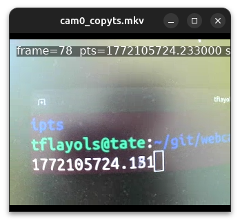

# webcams_sync

Small Linux toolkit to measure webcam pipeline latency using wall-clock timestamps.

Useful for multicam robot experiments: if robot state/telemetry is logged with Linux epoch time somewhere (CSV, DB, rosbag, etc.), video frames can be aligned to robot state by timestamp.

Status: highly vibecoded.

The idea is simple:
1. Display the current epoch time in a terminal.
2. Film that terminal with a webcam while recording video with frame timestamps tied to wall clock (`-copyts` + `-use_wallclock_as_timestamps 1`).
3. Extract the frame nearest to a target timestamp and compare:
   - Time shown in the filmed terminal
   - Frame timestamp in the recorded file

## Repository content

- `display_time.py`: prints current Unix time (seconds with milliseconds) continuously in the terminal.
- `nearest_frame.py`: finds and extracts the frame whose PTS is closest to a target epoch timestamp.
- `scripts/`: bash helpers replacing the old `cmds.txt` snippets.

## Requirements

- Linux with a V4L2 webcam device (`/dev/v4l/...`)
- `python3`
- `ffmpeg` tools (`ffmpeg`, `ffprobe`, `ffplay`)

## Quick workflow

### 1) Display the live clock

```bash
python3 display_time.py
```

This updates at ~100 Hz and prints epoch seconds, for example `1772097498.033`.

### 2) Record webcam video with wall-clock timestamps

Use:

```bash
./scripts/record_cam.sh [CAM_DEV] [OUT_VIDEO]
```

Examples:

```bash
./scripts/record_cam.sh
./scripts/record_cam.sh /dev/v4l/by-id/your-camera cam0_copyts.mkv
```

### 3) Inspect timestamps / frames

Get PTS (epoch seconds) of frame index `N`:

```bash
N=20
./scripts/frame_pts.sh cam0_copyts.mkv "$N"
```

Extract frame `N` to PNG and display it:

```bash
N=20
./scripts/show_frame.sh cam0_copyts.mkv "$N"
```

Extract frame `N`, read its timestamp, and show it in window title:

```bash
N=20
./scripts/show_frame_with_ts.sh cam0_copyts.mkv "$N"
```

Interactive playback with frame index and PTS overlay:

```bash
./scripts/play_with_overlay.sh cam0_copyts.mkv
```

See script help:

```bash
./scripts/record_cam.sh --help
./scripts/frame_pts.sh --help
./scripts/show_frame.sh --help
./scripts/show_frame_with_ts.sh --help
./scripts/play_with_overlay.sh --help
```

## Nearest-frame helper script

Find and extract the frame closest to a target epoch timestamp:

```bash
python3 nearest_frame.py cam0_copyts.mkv 1772097498.033
```

Show extracted frame in a window:

```bash
python3 nearest_frame.py cam0_copyts.mkv 1772097498.033 --show
```

Choose output file:

```bash
python3 nearest_frame.py cam0_copyts.mkv 1772097498.033 --out /tmp/frame.png
```

The script prints:
- `target_ts`
- `nearest_frame`
- `frame_ts`
- `abs_diff_s`
- `output`

## Latency measurement note

Use the interactive playback command above (`ffplay` with `drawtext`) to scrub/pause the video while reading `frame` and `pts` overlays, then compare with the clock value filmed in the image.

For exact extraction, you can still use `nearest_frame.py` with a target timestamp and compare:
- Clock value visible in the image
- Frame PTS reported by the tools

The difference approximates end-to-end capture/display latency.

## Example screenshot

Latency-test capture example:


